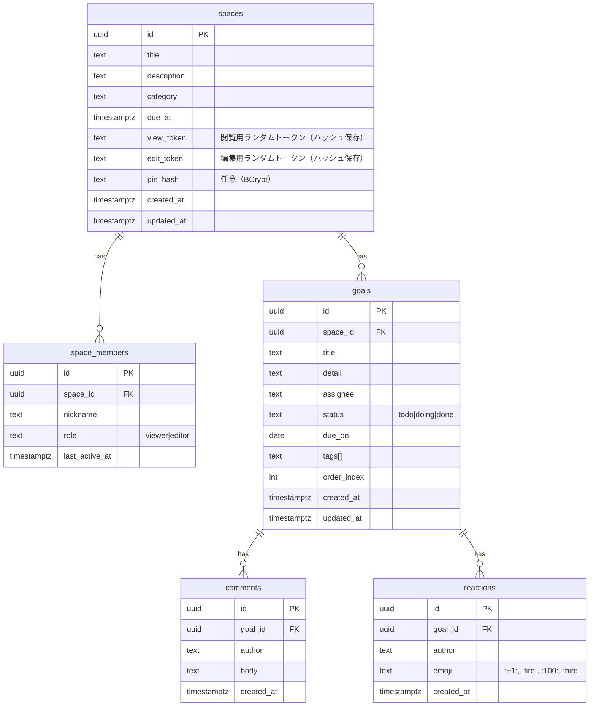

# Taskel（目標共有アプリ）要件レポート

> バージョン: 0.9 / 作成日: 2025-08-14 / 作成者: ChatGPT  
> コンセプト: **リンクをベースにした超シンプル共有**で、家族・友人・小さな仲間内の「目標・ToDo・進捗」をサクッと共有

---

## 0. ブランド・デザイン

- **サービス名**: Taskel
- **テーマカラー**: `#DC4409`（※ご指定の `#DC4409n` は無効な16進表記だったため、最も近い `#DC4409` を暫定採用。もし意図があれば修正します）
- **サブカラー案**: `#00BCD4`（シアン）、`#263238`（濃グレー）、`#F5F7FA`（背景）
- **マスコット**: シアンの小さな**小鳥**（くちばしがチェックマーク型）。完了時に羽ばたく/芽を運ぶなどの演出に利用。
- **トーン&マナー**: 温度感のあるミニマル（温かいオレンジ × 清潔な余白）

---

## 1. サービス概要

**Taskel** は、会員登録不要・インストール不要で、**共有リンク**からメンバーが参加して「目標・ToDoの登録、進捗の確認、応援コメント」を行えるWebアプリ。  
- **超軽量な導入**: 作成→リンク共有→即共同編集  
- **協働で継続**: 反応・応援でモチベ維持  
- **透明な進捗**: 誰が何をどこまでやったか1画面で把握

---

## 2. 想定ターゲット / ユースケース

- **対象**: 10〜30代のライトユーザー（家族/友人/恋人/小チーム）
- **シーン**:
  - 筋トレ・勉強・資格・ダイエットなど**習慣/自己改善**
  - 小さなイベント/旅行準備の**やること共有**
  - 家事分担や**見える化**

**価値仮説**: 「アプリを入れるほどではないが、**みんなで"今どこまで？"を見たい**」に最短で応える。

---

## 3. 機能要件（追加機能は記載しない方針）

### 3.1 コア機能
1. **スペース作成（=グループ）**
   - 入力: タイトル、説明、カテゴリ（運動/勉強/生活など任意）、期日（任意）
   - 出力: 固有URL（*viewer* と *editor* の2種を同時発行）  
     - 例:  
       - Viewer: `https://todolis.app/s/{spaceId}?t={viewToken}`  
       - Editor: `https://todolis.app/s/{spaceId}/edit?t={editToken}`  

2. **目標/ToDo 登録**
   - 項目: タイトル、詳細（任意）、担当（任意・自由入力）、期限（任意）、タグ（任意）
   - 状態: `未着手 / 進行中 / 完了`
   - 並び替え: 期限/状態/担当/作成順

3. **進捗管理**
   - チェック/状態更新、進捗率集計
   - タイムライン（更新履歴）

4. **コメント/リアクション**
   - 各項目にコメント
   - リアクション: 👍🔥💯🕊（小鳥）

5. **リアルタイム反映**
   - 楽観的UI + サーバー確定で反映（Pusher/SSE/WebSocket いずれか）

6. **簡易アクセス制御（リンクベース）**
   - **閲覧用トークン** と **編集用トークン** を分離
   - オプション: **短いPIN**（4〜6桁）を追加要求（URL流出対策）
   - スペース単位で**ローテーション**（再発行/旧トークン無効化）

### 3.2 非機能要件（抜粋）
- **モバイル最適化**（SP 1st）/ 初回30秒で「作る→共有→編集」完了
- **応答性能**: 操作の認知遅延 < 100ms / 反映 < 1s（体感）
- **可用性**: 99.9%/月 目標
- **セキュリティ**: HTTPS 必須、URLトークン128bit相当、PINはレート制限
- **ログ/監査**: 変更履歴（誰が/いつ/何を）
- **プライバシー**: Cookieは必要最小限（匿名セッションID）

---

## 4. 情報設計 / データモデル（PostgreSQL）



**留意**  
- `view_token`/`edit_token` は**平文保存しない**（`token_id` + `hash` の2分割管理可）。  
- トークン長は**20字以上のBase62**（128bit相当以上）を推奨。

---

## 5. API設計（Flask）

### 5.1 認証方式（リンクベース）
- リクエストヘッダ: `X-SPACE-ID`, `X-ACCESS-TOKEN`（Viewer/Editor）
- サーバ側で `token_scope(view|edit)` を判定し、**メソッド権限**を制御

### 5.2 代表エンドポイント
```
POST   /api/spaces.create           # スペース作成（view/editトークン生成）
POST   /api/spaces.rotate_tokens    # トークン再発行（edit権限）
POST   /api/spaces.verify_pin       # PIN検証（必要時）

GET    /api/goals.list              # 一覧（view以上）
POST   /api/goals.create            # 追加（edit）
PATCH  /api/goals.update/:id        # 更新（edit）
DELETE /api/goals.delete/:id        # 削除（edit）

POST   /api/comments.create         # コメント（viewでも可にするかは要検討）
POST   /api/reactions.toggle        # リアクション

GET    /api/activity.timeline       # 変更履歴の取得
```

**権限表（抜粋）**

| 機能                  | viewer | editor |
|-----------------------|:------:|:------:|
| 目標の閲覧            |   ✓    |   ✓    |
| 目標の追加/編集/削除  |   ×    |   ✓    |
| コメント/リアクション |  設計で選択（✓ 推奨） |  ✓ |
| トークン再発行        |   ×    |   ✓    |

---

## 6. フロント実装（React）

- **スタック**: React + Vite + TypeScript / 状態: Zustand or Redux Toolkit  
- **UI**: Tailwind CSS（ブランドカラー: `#DC4409`）  
- **構成（主要コンポーネント）**  
  - `SpaceCreator`（作成フォーム -> URL表示）  
  - `InviteBanner`（Viewer/Editorリンクのコピー、PIN設定）  
  - `GoalList`（並び替え/フィルタ）  
  - `GoalItem`（状態変更、期限、担当、タグ）  
  - `Comments` / `Reactions`  
  - `ActivityTimeline`  
- **リアルタイム**:  
  - 短期は**ポーリング**（5〜10s）で十分。将来は SSE/WebSocket に差し替え。
- **アクセシビリティ**: キーボード操作、ARIAロール、コントラスト比 4.5:1 以上。

---

## 7. バックエンド（Flask）/ インフラ（AWS）

- **実行**: Flask + Gunicorn（ECS Fargate） or Lambda（API Gateway + Lambda Powertools）
- **DB**: Amazon RDS for PostgreSQL（多AZ、自動バックアップ）
- **静的ホスティング**: S3 + CloudFront（SPAルーティング設定）
- **シークレット**: AWS Systems Manager Parameter Store（または Secrets Manager）
- **監視**: CloudWatch Logs / Metrics、アラーム（p95 レイテンシ、5xx率）
- **CI/CD**: GitHub Actions → ECR/ECS or S3/CloudFront Invalidation
- **セキュリティ**: WAF（Bot/Rate Limit ルール）、Shield Standard、Origin Access
- **可観測性**: 構造化ログ(JSON)、相関ID（`X-Request-ID`）

---

## 8. セキュリティ指針（リンク認証の補強）

- トークンは**ハッシュ保存**（漏洩時の被害最小化）
- **スコープ分離**（view/edit）と**短PIN**（任意/高リスク時）
- **レート制限**（IP + Token 単位、PIN試行は厳格）
- **トークンの失効/ローテーション**UIを提供
- CORS最小化、CSRFは状態レス主体なので限定的だが**書き込み系にCSRF対策**を適用
- 共有リンクの**注意喚起UI**（公開場所に貼らない、スクショ注意）

---

## 9. プロダクト計測 / 成長設計

- **KPI**: 7日継続率、1スペース当たりの**参加人数**/**目標数**、コメント/リアクション数、トークン再発行率
- **バイラル導線**: 完了時の**小鳥アニメ + シェア導線**（X/Instagram/LINEに画像付きで共有）
- **認知拡大施策**（指定方針のみ）:
  - **共有リンク経由の新規導入**（バイラル）
  - **マイクロインフルエンサー**（筋トレ・勉強系YouTuber）とのコラボ動画/レビュー

---

## 10. リリース計画（MVP）

- **M0（2〜3週）**: スペース作成、Viewer/Editorリンク、ToDo CRUD、リアクション、簡易タイムライン、S3+CF配信、RDS構築
- **M1（+2週）**: コメント、並び替え/絞り込み、PIN対応、トークン再発行、CloudWatch監視
- **M2（+2週）**: 軽量リアルタイム（SSE or ポーリング最適化）、WAF/RateLimit、計測KPI実装

---

## 11. 画面草案（ワイヤー案の言語化）

1. **ホーム/作成**
   - タイトル/説明/カテゴリ/期日 → 「作成」→ Viewer/Editor URL表示（コピー）
2. **一覧**
   - スペース名 + 小鳥マーク / 進捗率 / フィルタ（期限/担当/状態/タグ）
3. **アイテム詳細**
   - 状態、期限、担当、コメント、リアクション、タイムライン
4. **設定**
   - PIN設定/解除、トークン再発行、注意喚起

---

## 12. 品質/運用

- **負荷試験**: 1スペース同時編集 50〜100 人 / 1日数万PV での応答検証
- **バックアップ**: RDS PITR、S3バージョニング、IaC（CDK/Terraform）
- **障害時**: リードレプリカ昇格 / Blue-Green デプロイ / Rollback Playbook
- **法務**: 利用規約/プライバシーポリシー（匿名利用・リンク取扱いの注意点を明記）

---

## 13. リスクと対応

- **URL漏洩リスク** → PIN + ローテーション + レート制限 + 注意喚起
- **荒らし・スパム** → しきい値超過で一時ブロック、honeypot フィールド
- **モチベ低下** → 小鳥アニメ/週報メール（将来機能）/リアクション強化

---

## 付録A: テーマ/コンポーネント設計（抜粋）

```css
:root {
  --brand: #DC4409;
  --brand-contrast: #ffffff;
  --ink: #263238;
  --bg: #F5F7FA;
  --accent: #00BCD4;
}
.btn-brand { background: var(--brand); color: var(--brand-contrast); }
.link   { color: var(--accent); }
.badge-done { background: #e6f7f2; color: #0a7e53; }
```

---

**以上 — MVPに必要な要件を、React + Flask + PostgreSQL + AWS で実装する前提で整理しました。**
