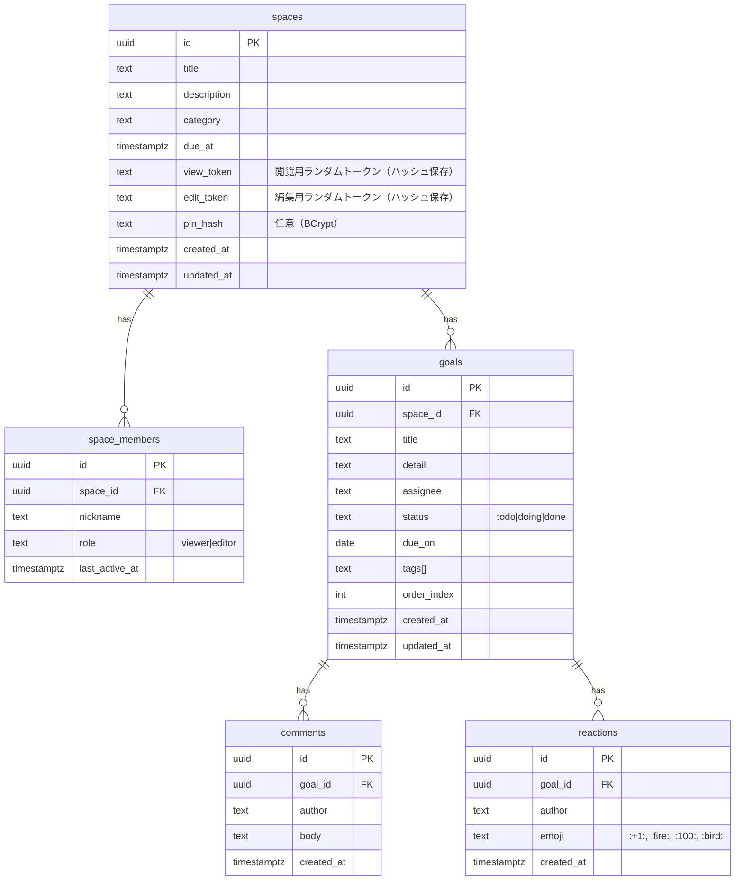

# Taskel データベース設計書

## 1. 設計概要

### 1.1 目的
このドキュメントは、目標共有アプリ「Grace」のデータベース構造と仕様を定義することを目的とします。

### 1.2 RDBMS
PostgreSQL

### 1.3 設計方針
- **命名規則**: テーブル名、カラム名はスネークケース（例: `space_members`）を採用します。
- **主キー(PK)**: 全てのテーブルで、推測困難な `UUID` 型を主キーとして使用します。
- **外部キー(FK)**: テーブル間の関連は外部キー制約によって定義します。
- **タイムスタンプ**: レコードの作成日時(`created_at`)と更新日時(`updated_at`)を全ての主要テーブルに含めます。

---

## 2. ER図 (Entity-Relationship Diagram)
各テーブル間の関連は以下の通りです。

---

## 3. テーブル定義詳細

### 3.1 `spaces` テーブル
共有スペース（グループ）の情報を格納します。

| カラム名 | データ型 | 制約 | 説明 |
|---|---|---|---|
| `id` | `uuid` | PK | 主キー |
| `title` | `text` | NOT NULL | スペースのタイトル |
| `description` | `text` | | スペースの説明 |
| `category` | `text` | | カテゴリ（勉強、旅行など） |
| `due_at` | `timestamptz` | | 期日 |
| `view_token` | `text` | NOT NULL, UNIQUE | 閲覧用トークンのハッシュ値 |
| `edit_token` | `text` | NOT NULL, UNIQUE | 編集用トークンのハッシュ値 |
| `pin_hash` | `text` | | PINコードのハッシュ値（BCrypt） |
| `created_at` | `timestamptz` | NOT NULL | 作成日時 |
| `updated_at` | `timestamptz` | NOT NULL | 更新日時 |

### 3.2 `space_members` テーブル
（将来機能用）スペースに参加したメンバーの情報を格納します。

| カラム名 | データ型 | 制約 | 説明 |
|---|---|---|---|
| `id` | `uuid` | PK | 主キー |
| `space_id` | `uuid` | FK (spaces.id) | どのスペースか |
| `nickname` | `text` | NOT NULL | ユーザーのニックネーム |
| `role` | `text` | NOT NULL | 役割（viewer or editor） |
| `last_active_at` | `timestamptz` | | 最終アクティブ日時 |

### 3.3 `goals` テーブル
目標やToDoアイテムの情報を格納します。

| カラム名 | データ型 | 制約 | 説明 |
|---|---|---|---|
| `id` | `uuid` | PK | 主キー |
| `space_id` | `uuid` | FK (spaces.id) | どのスペースに属するか |
| `title` | `text` | NOT NULL | 目標のタイトル |
| `detail` | `text` | | 目標の詳細 |
| `assignee` | `text` | | 担当者名 |
| `status` | `text` | NOT NULL | 状態（todo, doing, done） |
| `due_on` | `date` | | 期限日 |
| `tags` | `text[]` | | タグ（配列） |
| `order_index` | `int` | | 表示順序のためのインデックス |
| `created_at` | `timestamptz` | NOT NULL | 作成日時 |
| `updated_at` | `timestamptz` | NOT NULL | 更新日時 |

### 3.4 `comments` テーブル
各目標へのコメントを格納します。

| カラム名 | データ型 | 制約 | 説明 |
|---|---|---|---|
| `id` | `uuid` | PK | 主キー |
| `goal_id` | `uuid` | FK (goals.id) | どの目標へのコメントか |
| `author` | `text` | | コメント投稿者名 |
| `body` | `text` | NOT NULL | コメント本文 |
| `created_at` | `timestamptz` | NOT NULL | 作成日時 |

### 3.5 `reactions` テーブル
各目標へのリアクションを格納します。

| カラム名 | データ型 | 制約 | 説明 |
|---|---|---|---|
| `id` | `uuid` | PK | 主キー |
| `goal_id` | `uuid` | FK (goals.id) | どの目標へのリアクションか |
| `author` | `text` | | リアクションした人 |
| `emoji` | `text` | NOT NULL | 絵文字の種類（例: `:+1:`） |
| `created_at` | `timestamptz` | NOT NULL | 作成日時 |

---

## 4. インデックス設計
パフォーマンス向上のため、以下のカラムにインデックスを作成することを推奨します。

- **`spaces`**: `id` (PKにより自動作成)
- **`space_members`**: `space_id`
- **`goals`**: `space_id`, `status`, `due_on`
- **`comments`**: `goal_id`
- **`reactions`**: `goal_id`

---

## 5. セキュリティに関する考慮事項
- **トークンの保存**: `view_token` および `edit_token` は、平文でデータベースに保存せず、必ずハッシュ化（SHA-256など）した値を保存します。
- **PINコードの保存**: `pin_hash` は、BCryptのようなストレッチング耐性のあるアルゴリズムでハッシュ化して保存します。
- **トークンの衝突**: トークンは十分に長いランダムな文字列（Base62で20文字以上を推奨）とし、衝突の可能性を限りなく低くします。
